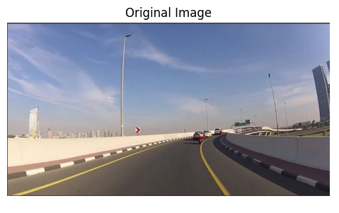
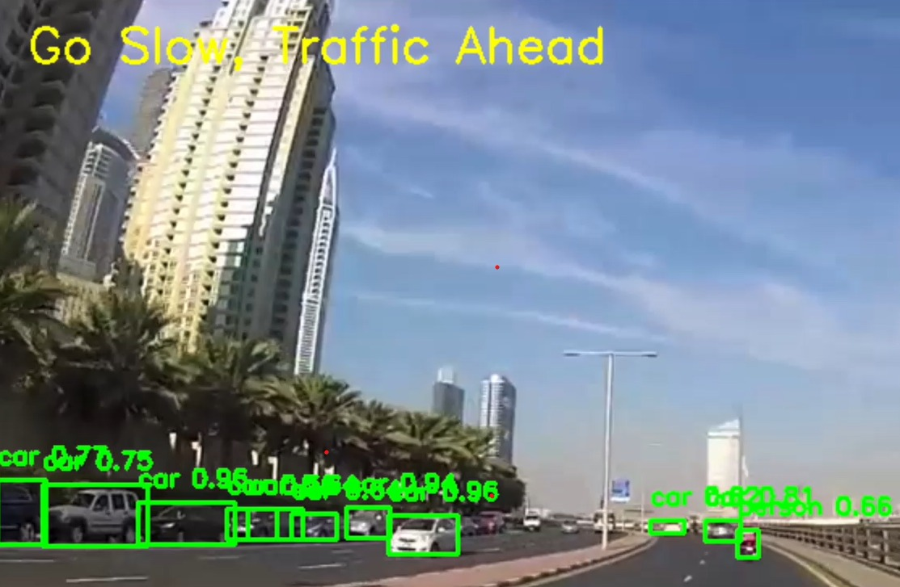
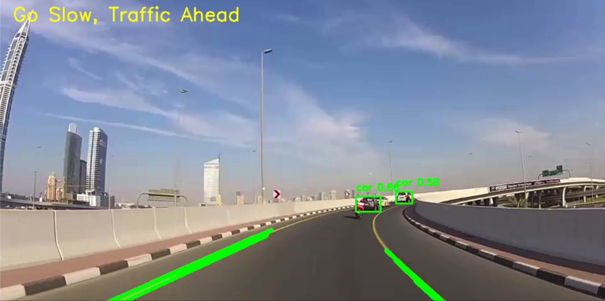

# 🚗 Lane and Object Detection for Autonomous Vehicles

A real-time autonomous driving assistance system that combines **Lane Detection** and **Object Detection** using **OpenCV** and **YOLOv3**. The system identifies lane boundaries, detects surrounding vehicles/objects, and provides real-time driving feedback such as:

* **"Stay on the Lane"**
* **"Go Slow, Traffic Ahead"**

This project was developed as part of a team project and later presented at the **ICSIC 2025 Conference**.

---

## 📌 Features

- Real-time lane detection for autonomous driving assistance
- Vehicle and object detection using YOLOv3
- Dynamic driving alerts such as:
  - “Stay on the Lane”
  - “Go Slow, Traffic Ahead”
- Real-time traffic awareness system
- Detection of surrounding vehicles with confidence scores
- Lane boundary visualization on road footage
- High-speed real-time processing (95–100 FPS)
- Integrated Computer Vision + Deep Learning pipeline
- Works on recorded driving video input

---

## 🧠 Core Techniques Used

- Gaussian Blur
- HSV Color Space Segmentation
- Canny Edge Detection
- Hough Line Transform
- Non-Maximum Suppression (NMS)
- YOLOv3 Object Detection
- OpenCV DNN Module

---

## ⚙️ Methodology

### 1. Image Preprocessing

* Gaussian Blur is applied to reduce noise.
* Frames are converted from BGR to HSV color space.

### 2. Lane Detection

* HSV thresholding isolates lane colors.
* Canny Edge Detection identifies lane edges.
* Hough Line Transform extracts lane lines.

### 3. Object Detection

* YOLOv3 detects surrounding vehicles and objects.
* Bounding boxes and confidence scores are displayed in real-time.

### 4. Real-Time Feedback

Based on lane and object detection:

* "Stay on the Lane"
* "Go Slow, Traffic Ahead"

alerts are generated dynamically.

## 📸 Project Outputs

### Original Frame
<p align="center">
  
</p>

### Object Detection using YOLOv3
<p align="center">
  
</p>

### Lane + Object Detection with Traffic Alert
<p align="center">
  
</p>

## 📄 Conference Publication

This project was associated with a research paper presented at:

**Proceedings of the 9th International Conference on Inventive Systems and Control (ICSIC-2025)** 

Paper included in repository:

* `ICSIC-2025-lane-detection-paper.pdf`

---

## 📂 Project Structure

```bash
lane-detection-autonomous-vehicles/
│
├── main.py
├── yolov3.cfg
├── coco.names
├── README.md
├── ICSIC-2025-lane-detection-paper.pdf
├── ICSIC-2025-lane-object-detection.pdf
└── images/
```

---

## ▶️ How to Run

### 1. Clone Repository

```bash
git clone https://github.com/your-username/lane-detection-autonomous-vehicles.git
```

### 2. Install Dependencies

```bash
pip install opencv-python numpy
```

### 3. Download YOLOv3 Weights

Download:

* `yolov3.weights`

Place it inside the project directory.

### 4. Run the Project

```bash
python main.py
```

---

## 📈 Results

* Accurate lane boundary detection
* Real-time vehicle recognition
* Dynamic driving alerts
* High FPS real-time performance
* Robust performance under standard road conditions

The proposed system achieved:

* **~90% lane detection accuracy**
* **95–100 FPS real-time execution** 

---

## 🚀 Future Improvements

* Pedestrian-specific detection optimization
* Weather-resistant lane detection
* Curved lane prediction
* Integration with embedded systems
* Autonomous steering assistance

---

